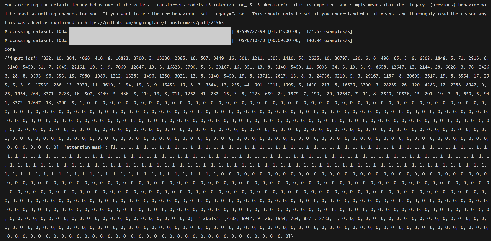
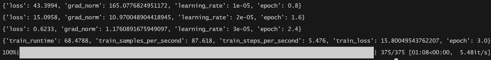
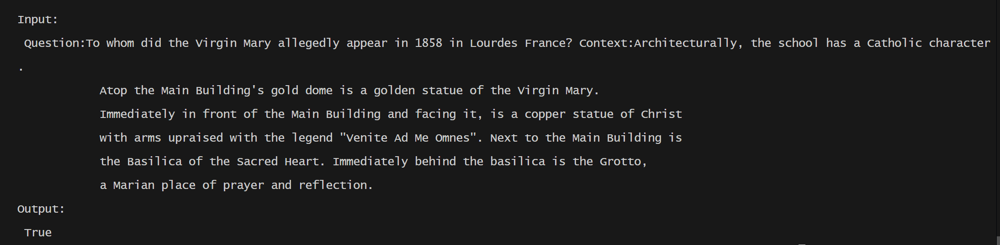

The `t5` model in this folder is implemented using the transformers library from HuggingFace.


## Train
```bash
python Trainer.py
```


## Inference
```bash
python Inference.py
```


---

## SQUAD Preprocess Result:



---


## Training Snapshot


---

## Inference Snapshot
```python
if __name__ == '__main__':
    # output = inference("User: who are you? Agent:")

    # print("\n",output)

    context = '''Architecturally, the school has a Catholic character. 
            Atop the Main Building's gold dome is a golden statue of the Virgin Mary. 
            Immediately in front of the Main Building and facing it, is a copper statue of Christ 
            with arms upraised with the legend "Venite Ad Me Omnes". Next to the Main Building is
            the Basilica of the Sacred Heart. Immediately behind the basilica is the Grotto, 
            a Marian place of prayer and reflection.'''
    question  = "To whom did the Virgin Mary allegedly appear in 1858 in Lourdes France?"
    test_inputs = [  
        f"Question:{question} Context:{context}",  
    ]  

    for test_input in test_inputs:  
        output = inference(test_input)  
        print(f"\nInput:\n {test_input}")  
        print(f"Output:\n {output}")  

```


---
## Dataset that can be used to fine-tune T5

1. **文本摘要任务**：
- **CNN/DailyMail数据集**[^4](https://www.kaggle.com/code/maverickss26/fine-tune-t5-transformer-for-text-summarization)
  - 包含新闻文章及其摘要
  - 规模大，质量高
  - 适合训练生成式摘要任务
```python
from datasets import load_dataset
dataset = load_dataset("ccdv/cnn_dailymail", version="3.0.0")
```

2. **问答任务**：
- **SQuAD (Stanford Question Answering Dataset)**[^6](https://medium.com/@ajazturki10/simplifying-language-understanding-a-beginners-guide-to-question-answering-with-t5-and-pytorch-253e0d6aac54)
  - 包含10万+问答对
  - 基于维基百科文章
  - 适合训练抽取式和生成式问答
```python
dataset = load_dataset("squad")
```

3. **翻译任务**：
- **WMT数据集**
  - 多语言平行语料库
  - 支持多种语言对
```python
dataset = load_dataset("wmt16", "de-en")  # 德语-英语翻译
```

4. **文本分类/情感分析**：
- **GLUE基准测试集**
  - 包含多个子任务
  - 标准化的评估指标
```python
dataset = load_dataset("glue", "sst2")  # 情感分析任务
```

5. **自定义任务数据集**：
如果您有特定领域的任务，可以按以下格式准备数据[^1](https://discuss.huggingface.co/t/fine-tuning-t5-with-custom-datasets/8858)：
```python
{
    "source_text": "summarize: YOUR_INPUT_TEXT",
    "target_text": "EXPECTED_OUTPUT"
}
```

使用示例：
```python
# 1. 加载数据集
from datasets import load_dataset

# 文本摘要任务
summarization_dataset = load_dataset("ccdv/cnn_dailymail", version="3.0.0")

# 2. 数据预处理
def preprocess_summarization_data(examples):
    prefix = "summarize: "
    inputs = [prefix + doc for doc in examples["article"]]
    return {
        "source_text": inputs,
        "target_text": examples["highlights"]
    }

# 3. 应用预处理
processed_dataset = summarization_dataset.map(preprocess_summarization_data)
```

选择数据集的建议：

1. **根据任务选择**：
   - 文本生成 → CNN/DailyMail
   - 问答系统 → SQuAD
   - 机器翻译 → WMT
   - 分类任务 → GLUE


## 注意事项
### 显存管理：
如果显存不足，可以：
- 减小batch_size
- 增加gradient_accumulation_steps
- 使用更小的模型（如t5-small）
- 启用混合精度训练

### 训练技巧：
- 使用AdaFactor优化器通常效果更好
- 根据任务适当调整max_source_length和max_target_length
- 使用early stopping避免过拟合
- 定期保存检查点

### 性能优化：
- 使用DataParallel或DistributedDataParallel进行多GPU训练
- 使用gradient clipping防止梯度爆炸
- 适当使用learning rate scheduler